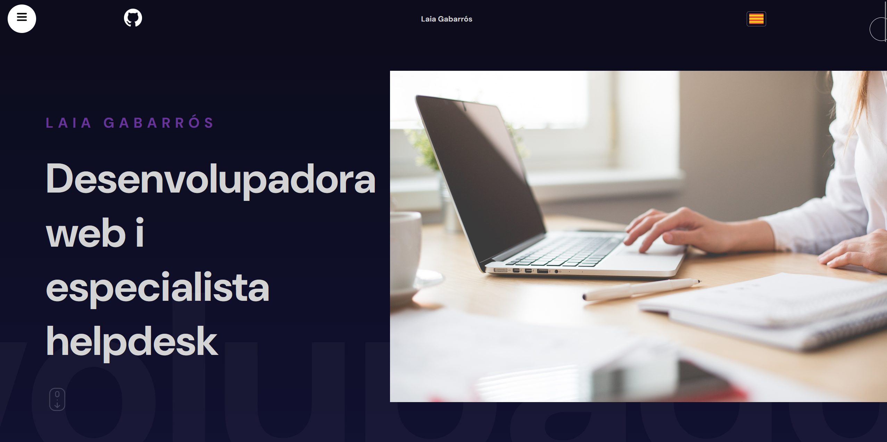
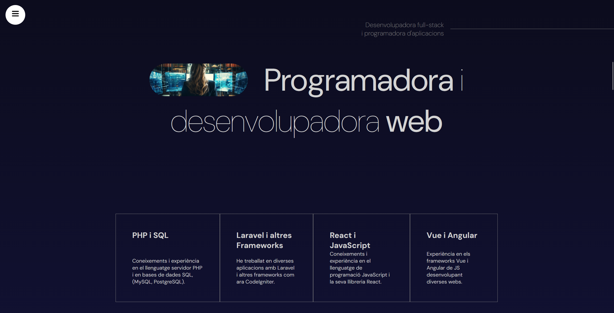
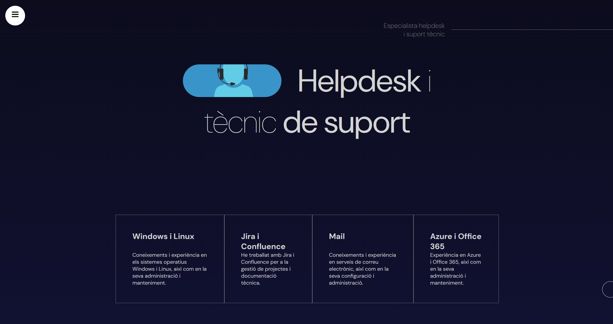
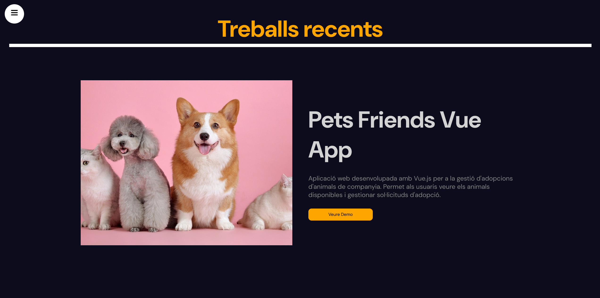
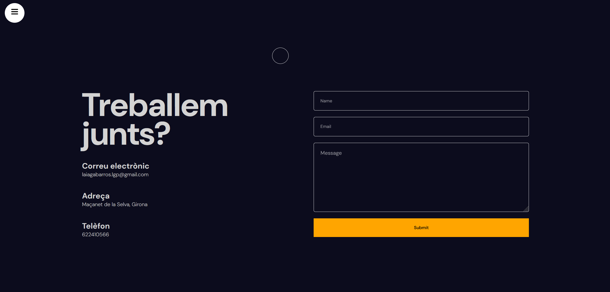

# React + Vite

REACT LAIA GABARROS PORTFOLIO

A web application for a front-end development portfolio project.

https://portfolio-opal-eight-53.vercel.app/

🖼️ SCREENSHOTS OF THE PROJECT:

Home, Services/Helpdesk, Portfolio, Contact.

✨ Features

    Home — landing page introducing the portfolio.
    Services — programming skills.
    Helpdesk — helpdesk skills.
    Portfolio — links to different demo projects.
    Contact — contact page.

🛠️ Tech stack

    React — Javascript library for the Front-end project.
    VITE v5.4.21 - serves as a modern build tool and development server that has replaced Create React App (CRA) to compile, bundle, and serve the application.
    Custom SCSS — hand-built design system using CSS variables, no UI framework

📁 Project structure

src/
├── components/  
    ├── contact/
    ├── cursor/
    ├── hepdesk/
    ├── hero/
    ├── languageSelector/
    ├── navbar/
    ├── parallax/
    ├── portfolio/
    ├── services/
    └── sidebar/                         # models + services (MenuService, RecipesService, in-memory API...)
├── locales/

🚀 Getting started

# 1. Clone the repository
git clone 
cd https://github.com/LaiGP/portfolio

# 2. Install dependencies
npm install

# 3. Run the development server
npm run dev

The app will be available at http://localhost:5173/.

📜 Available scripts

Command 	Description
npm start 	Runs the app in development mode (ng serve)
npm run build 	Builds the app for production
npm run watch 	Builds and watches for changes
npm test 	Runs unit tests

👩‍💻 Author

[Laia Gabarrós] Junior Frontend Developer GitHub
📄 License

This project is open source and available under the MIT License.
